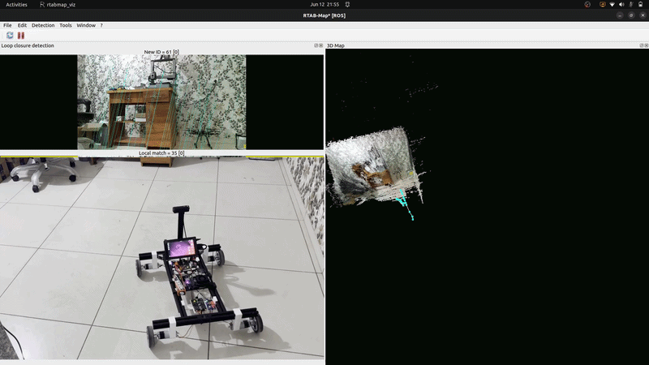

# Edge AI Mobile Base: VIO SLAM Subsystem

🟢 **System Status:** Active R&D / Phase 2 (Perception Optimization)

**The foundational mobility and spatial awareness module for an upcoming Embodied AI Mobile Manipulator. This independent subsystem utilizes ROS 2 Humble, NVIDIA Jetson, and an OAK-D Lite to achieve robust encoderless Visual-Inertial Odometry (VIO) and map generation.**



## 🧠 Modular Architecture Context

This repository houses the **Mobility and Perception Subsystem**. Operating as a fully independent Autonomous Mobile Robot (AMR) base, it is engineered with a strict **Distributed Middleware Architecture** to isolate real-time motor actuation from heavy spatial AI processing:

* **Actuation Layer (Low-Level):** An ESP32 microcontroller acting as a Hardware Abstraction Layer (HAL). It handles deterministic differential mixing and interfaces directly with Cytron motor drivers via a high-speed wireless UDP bridge.
* **Perception Layer (High-Level):** An NVIDIA edge compute node (Jetson) processing spatial depth maps and executing Visual-Inertial Odometry via ROS 2, eliminating the reliance on standard hardware wheel odometry.

---

## 📂 Repository Structure

```text
edge-ai-mobile-base/
├── cad/                        # 3D printable STL files and mechanical assembly diagrams
├── bom/
│   └── bill_of_materials.md    # Component specs (motors, drivers, compute units)
├── esp_firmware/               # MicroPython code executed directly on the ESP32 HAL
│   ├── phase1_ap_mode/         # Standalone Wi-Fi Access Point execution script
│     └── main.py
│   └── phase2_client_mode/     # Distributed ROS 2 Subnet network execution script
│     └── main.py
├── host_controller/            # Python drive scripts executed on the Ubuntu Host Laptop
│   ├── phase1_manual/   
|     └──  robo_drive.py    
│   └── phase2_teleop/          # Routed subnet teleop mixing script (Subnet Client)
|     └── control.py    
├── ros2_nodes/                 # Perception stack executed directly on the NVIDIA Jetson
│   └── salm_ready.launch.py    # Custom VIO & RTAB-Map spatial mapping sequence
└── README.md                   # System overview & Deployment guide

```

---

## 🚀 Development Phases

### Phase 1: Hardware & Baseline Actuation - *Completed*

The foundational cycle focused entirely on verifying the physical chassis and ensuring deterministic, low-latency control before introducing AI overhead.

* **Mechanical & Electrical:** Designed custom 3D-printed mounting brackets for the Jetson and OAK-D. Integrated 12V motors and Cytron dual-channel drivers. *(See `/cad/` and `/bom/`)*
* **Wireless Teleoperation:** Engineered a high-speed MicroPython UDP server on the ESP32.
* **Kinematic Mixing:** Implemented a host-side teleoperation script to map standard Xbox controller axes into calculated differential PWM limits with strict deadzone filtering and emergency stop fallbacks.

### Phase 2: Embodied AI & Perception Integration - *Current*

Transitioning control from manual UDP teleoperation to an autonomous, middleware-driven ecosystem.

* **Middleware Integration:** Deployed ROS 2 Humble on the NVIDIA Jetson edge compute node.
* **Encoderless VIO SLAM:** Replaced physical wheel odometry with RTAB-Map's `rgbd_odometry` using the OAK-D Lite depth stream and internal IMU.
* **SLAM Resiliency Tuning:** Implemented custom parameter overrides (`Odom/GuessMotion: 'true'`, `Odom/ResetCountdown: '0'`) allowing the localization engine to predictive-coast during rapid yaw rotations to survive visual motion blur.
* **System-Level Optimization:** Tuned the Linux network kernel (`sysctl`) to expand packet fragmentation thresholds, stabilizing high-bandwidth point-cloud transmission.

---

## 🛠️ System Deployment & Replication Guide

Due to the distributed nature of this platform, setup and execution are split across the **ESP32 (Hardware Abstraction Layer)**, the **NVIDIA Jetson (Edge Node)**, and the **Ubuntu Host Laptop (Teleop & Visualization)**.

### Track 0: Actuation Firmware Installation (ESP32)

Before the AI middleware can communicate with the physical chassis, the ESP32 must be flashed with the correct network and kinematics firmware using the **Thonny IDE**.

1. **Select Operational Mode:**
* **Phase 1 (Standalone AP):** Use `esp_firmware/phase1_ap_mode/main.py`. The ESP32 hosts its own isolated Wi-Fi network. Best for raw teleop testing without a router.
* **Phase 2 (Subnet Client):** Use `esp_firmware/phase2_client_mode/main.py`. The ESP32 connects to your shared subnet (e.g., mobile hotspot) alongside the Jetson. **This is required for ROS 2 SLAM.**


2. **Configure Network:** Open the selected `main.py` in Thonny. If using Phase 2, update the hardcoded `SSID` and `PASSWORD` to match your host network.
3. **Flash:** Connect the ESP32 via USB, save `main.py` directly to the MicroPython device, and power cycle the chassis. The onboard LED will turn solid once the network and UDP listening socket (Port `12345`) are established.

---

### Track A: NVIDIA Jetson Setup (Perception Node)

**1. Base Dependencies & ROS 2 DepthAI Drivers**

```bash
sudo apt update && sudo apt upgrade -y
sudo apt install -y build-essential python3-dev htop nvtop gedit
sudo apt install -y libyaml-cpp-dev libarchive-dev libbz2-dev zlib1g-dev libcurl4-openssl-dev libprotobuf-dev protobuf-compiler liblzma-dev liblz4-dev
sudo apt install ros-humble-depthai-ros ros-humble-depth-image-proc ros-humble-rtabmap-launch -y
echo "source /opt/ros/humble/setup.bash" >> ~/.bashrc

```

**2. Deep Learning Environment Setup**
By default, NVIDIA Jetson platforms come pre-configured with TensorRT and CUDA bound to the native system Python.

*Standard Installation (Recommended):*
For the most stable experience, install the vision dependencies directly to your system:

```bash
pip3 install "numpy>=1.24,<2.0" opencv-python==4.9.0.80 tqdm pycuda

```

*Advanced Configuration (Conda Environments):*

> ⚠️ *Note: If you choose to use Miniconda to isolate your vision environment, Conda will break the native Jetson TensorRT and CUDA pathings. You must manually symlink the system libraries into your Conda environment.*

If you are using a Conda environment named `vision`, execute the following to restore hardware acceleration:

```bash
# 1. Install base dependencies inside Conda
conda install -c nvidia cuda-toolkit=12.4.1 cuda-version=12.4 cudnn -y
pip install "numpy>=1.24,<2.0" opencv-python==4.9.0.80 tqdm

# 2. Clean out conflicting conda libraries and link Jetson's native TensorRT bindings
rm -rf ~/miniconda3/envs/vision/lib/python3.10/site-packages/tensorrt*
rm -rf ~/miniconda3/envs/vision/lib/python3.10/site-packages/graphsurgeon*

ln -s /usr/lib/python3.10/dist-packages/tensorrt ~/miniconda3/envs/vision/lib/python3.10/site-packages/
ln -s /usr/lib/python3.10/dist-packages/graphsurgeon ~/miniconda3/envs/vision/lib/python3.10/site-packages/

# 3. Export explicit paths to your local CUDA compiler
export PATH=/usr/local/cuda-12.6/bin:$PATH
export LD_LIBRARY_PATH=/usr/lib/aarch64-linux-gnu:/usr/local/cuda-12.6/lib64:$LD_LIBRARY_PATH
export CUDA_ROOT=/usr/local/cuda-12.6

# 4. Force-compile PyCUDA from source against the localized compiler target
pip install pycuda --force-reinstall --no-binary :all:

```

**3. High-Throughput Kernel Tuning (Mandatory for Point Clouds)**
Execute this script to prevent ROS 2 node instability caused by UDP packet fragmentation over Wi-Fi:

```bash
sudo sysctl -w net.core.rmem_max=2147483647
sudo sysctl -w net.ipv4.ipfrag_time=3
sudo sysctl -w net.ipv4.ipfrag_high_thresh=134217728

```

---

### Track B: Ubuntu Host Laptop Setup (Teleop & Visualization)

**1. Teleoperation Environment**
Ensure an Xbox Controller is paired via Bluetooth to the laptop.

```bash
pip3 install pygame

```

**2. ROS 2 Visualization Dependencies**
The host laptop does not run the SLAM math, but it must be able to visualize the TF trees and point clouds generated by the Jetson.

```bash
sudo apt update
sudo apt install ros-humble-desktop ros-humble-rtabmap-viz -y
echo "source /opt/ros/humble/setup.bash" >> ~/.bashrc

```

---

## ⚡ Execution Sequence

To bring the entire Embodied AI platform online, execute these commands in the following sequence across your network:

**1. Initiate Teleoperation (Host Laptop)**

```bash
python3 host_controller/phase2_teleop/control.py

```

*(Use the Left Joystick to drive. The script manages raw kinematics and safety deadzones).*

**2. Initialize Vision Drivers (Jetson Terminal 1)**

```bash
ros2 launch depthai_ros_driver rgbd_pcl.launch.py 

```

**3. Launch Odometry & SLAM Engine (Jetson Terminal 2)**

```bash
rm -rf ~/.ros/rtabmap.db  # Clear stale mapping data
ros2 launch ros2_nodes/slam_ready.launch.py

```

**4. Remote Spatial Visualization (Host Laptop Terminal)**

```bash
ros2 run rtabmap_viz rtabmap_viz --ros-args -r rtabmap:=/rtabmap -r odom:=/rtabmap/odom

```
